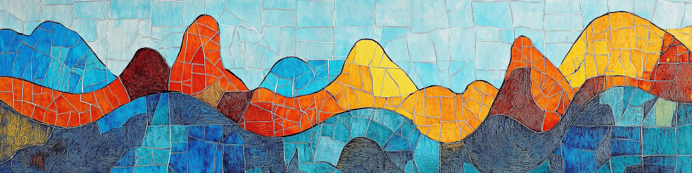

> The course has a mandatory home assignment divided into two parts. You can view the problems as html, pdf or download the quarto file for the exercise.

::: callout-important
## Important

-   The assignments are to be solved in **groups of three students**.

-   You must **use R**.

-   The report should be written using a **Quarto document**.

You submit both the Quarto file and the compiled report in pdf format. The submission is on the Athena platform, where **only one of the group members submit** the report, with the **names of all three group members on the first page**.
:::

**Home assignment - part 1**\
[html](assignment/AssignmentPart1.qmd) \| [pdf](assignment/AssignmentPart1.pdf) \| [quarto](https://github.com/StatisticsSU/STM/raw/main/assignment/AssignmentPart1.qmd)

Deadlines for part 1 (Spring 2026 version):

-   **Deadline for submission: April 23**
-   Feedback from teaching assistants: May 6
-   Deadline for possible corrections: May 14

**Home assignment - part 2**\
[html](assignment/AssignmentPart2.qmd) \| [pdf](assignment/AssignmentPart2.pdf) \| [quarto](https://github.com/StatisticsSU/STM/raw/main/assignment/AssignmentPart2.qmd)

Deadlines for part 2 (Spring 2026 version):

-   **Deadline for submission: May 13**
-   Feedback from teaching assistants: May22
-   Deadline for possible corrections: June 1
